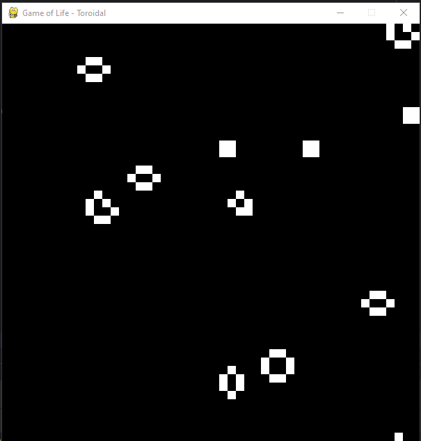

# Toroidal Game of Life in Python

This was another exercise from @Bernd-Ulmann

## Description

This project is an implementation of Conway's Game of Life in Python, utilizing a toroidal (wrap-around) grid. The Game of Life is a cellular automaton devised by mathematician John Conway. It simulates the evolution of cells on a grid based on simple rules, creating complex and interesting patterns over time.

The toroidal behavior means that the grid is considered to wrap around at the edges, allowing cells on the left edge to interact with cells on the right edge, and cells on the top edge to interact with cells on the bottom edge.



## How to Play

1. **Installation**
   - Ensure you have Python installed on your system.
   - Clone this repository to your local machine using `git clone https://github.com/your-username/toroidal-game-of-life.git`.
   - Navigate to the project directory using the command line.

2. **Dependencies**
   - This project requires the `pygame` library to run. You can install it using `pip`:
     ```
     pip install pygame
     ```

3. **Running the Game**
   - Run the game using the following command:
     ```
     python game_of_life.py
     ```
   - A window will open displaying the toroidal grid of cells.

4. **Game Controls**
   - **Pause/Resume**: Press the `SPACE` key to pause or resume the simulation.
   - **Toggle Cell**: Click on a cell with the mouse to toggle its state between alive and dead.

5. **Exiting the Game**
   - Close the game window or press `CTRL + C` in the terminal to stop the game.

## License

This project is licensed under the MIT License - see the [LICENSE](LICENSE) file for details.

## Contact

For questions or suggestions, feel free to contact:

- Víctor Duarte Melo
- Email: victormeloasm@gmail.com

Happy cellular automating!
```
